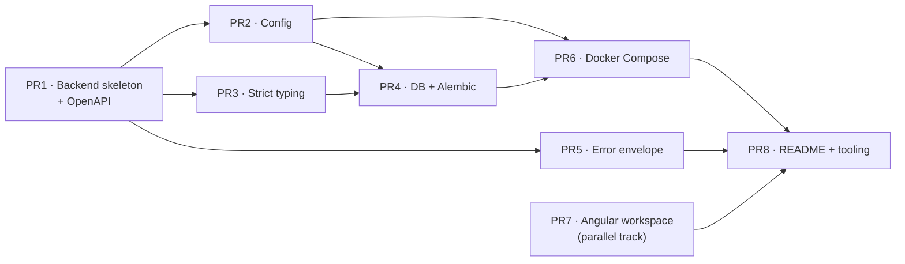

# Milestone M0 — Scaffolding

**Version:** 1.0  
**Status:** Draft  
**Created:** 2026-06-07  
**Last updated:** 2026-06-07  
**Companion to:** [DESIGN_V1.md](./DESIGN_V1.md) · [REQUIEREMENTS_V1.md](./REQUIEREMENTS_V1.md) · [OPEN_DECISIONS_V1.md](./OPEN_DECISIONS_V1.md) · [FUTURE_WORK_V1.md](./FUTURE_WORK_V1.md)  

This is the detailed definition of the first milestone in the delivery plan ([DESIGN §10](./DESIGN_V1.md#10-delivery-plan-milestones)),
which that table summarises in a single row. It expands M0 into independently reviewable, separately-mergeable
work items (one PR each).

---

## Table of Contents

- [Milestone M0 — Scaffolding](#milestone-m0--scaffolding)
  - [Table of Contents](#table-of-contents)
  - [1. Goal \& Scope](#1-goal--scope)
  - [2. Definition of Done (milestone exit criteria)](#2-definition-of-done-milestone-exit-criteria)
  - [3. Explicitly Out of Scope](#3-explicitly-out-of-scope)
  - [4. Work Items (PR breakdown)](#4-work-items-pr-breakdown)
    - [4.1 Summary](#41-summary)
    - [4.2 Dependency graph](#42-dependency-graph)
    - [PR1 — Backend application skeleton \& OpenAPI ✅](#pr1--backend-application-skeleton--openapi-)
    - [PR2 — Configuration module (config-over-code)](#pr2--configuration-module-config-over-code)
    - [PR3 — Strict type-safety setup](#pr3--strict-type-safety-setup)
    - [PR4 — Database session \& Alembic harness](#pr4--database-session--alembic-harness)
    - [PR5 — Error envelope \& exception handler](#pr5--error-envelope--exception-handler)
    - [PR6 — Docker Compose stack](#pr6--docker-compose-stack)
    - [PR7 — Angular workspace skeleton](#pr7--angular-workspace-skeleton)
    - [PR8 — README \& developer tooling](#pr8--readme--developer-tooling)
  - [5. Suggested Sequencing](#5-suggested-sequencing)
  - [6. Requirement Coverage Matrix](#6-requirement-coverage-matrix)

---

## 1. Goal & Scope

M0 stands up the **empty, runnable shell** of both applications so that every later milestone has a structural
home and a working dev loop to build into. It delivers **no domain behaviour** — no entities, no business rules,
no real screens. Its value is entirely in the foundation: the layout of [DESIGN §4](./DESIGN_V1.md#4-repository-layout),
the API-first contract surface of [§3.2](./DESIGN_V1.md#3-system-architecture), config-over-code
([§3.5](./DESIGN_V1.md#3-system-architecture)), the runnable Docker stack ([§8.1](./DESIGN_V1.md#81-tooling--infrastructure)),
and the strict type-safety baseline that [§5.7](./DESIGN_V1.md#57-type-safety) requires be **established now so it
is enforced from the first commit rather than retrofitted**.

It is sequenced first because the delivery plan is **backend-first** and because the scaffolding is what makes the
subsequent slices reviewable: by the end of M0, a reviewer can `docker compose up`, open Swagger, and read a
README that explains how to run and test everything.

**Delivers (DESIGN §10 row M0):** repo skeletons · config · Docker Compose stack · OpenAPI served · strict
type-safety setup · top-level README.

**Key requirements:** [§3.5](./DESIGN_V1.md#3-system-architecture), [§4 layout](./DESIGN_V1.md#4-repository-layout),
[§5.7](./DESIGN_V1.md#57-type-safety), [§8.1](./DESIGN_V1.md#81-tooling--infrastructure), `NFR-MAINT-05`
(and `NFR-MAINT-01/03/04`, `§3.2` picked up by the scaffolding).

---

## 2. Definition of Done (milestone exit criteria)

M0 is complete when **all** of the following hold (each is checked by exactly one PR below):

- [ ] `docker compose up` starts **PostgreSQL + the backend** as one stack; the backend reports healthy.
- [ ] `GET /api/v1/health` returns `200` (the only endpoint in M0 — a liveness placeholder until M1 adds real routes).
- [ ] **OpenAPI is served**: Swagger UI at `/docs` and the schema at `/openapi.json`, namespaced under `/api/v1` (`NFR-MAINT-01`, `§3.2`).
- [ ] `alembic upgrade head` runs cleanly against the composed Postgres — an **empty baseline** with **no domain tables** (those are M1).
- [ ] The backend **strict type-check passes with zero errors** (pyright in strict mode); the shared Pydantic base is `strict=True`, `extra="forbid"` (`§5.7`).
- [ ] Any error response uses the single envelope `{ "error": { "code": "...", "message": "..." } }` (`NFR-MAINT-03`), verifiable via a forced 404/validation error.
- [ ] **No environment-specific value is hardcoded** — config is read from the environment via `pydantic-settings`; `.env.example` is committed (`NFR-MAINT-04`, `§3.5`).
- [ ] The **Angular workspace builds in production mode** (`ng build`), strict TypeScript is on, the [§4](./DESIGN_V1.md#4-repository-layout) folder skeleton exists, and `environment.ts` holds the API base URL (`§8` wiring).
- [ ] A **top-level README** documents how to run the app, how to run tests, and where the API docs are (`NFR-MAINT-05`).

---

## 3. Explicitly Out of Scope

M0 deliberately ships **structure without behaviour**. The following are *not* in M0; each is owned by a later
milestone (per [DESIGN §10](./DESIGN_V1.md#10-delivery-plan-milestones)) and PRs here must not drift into them:

| Deferred from M0                                                                               | Owned by                           |
| ---------------------------------------------------------------------------------------------- | ---------------------------------- |
| Domain ORM models + the 7-table migration ([§5.2](./DESIGN_V1.md#52-data-persistence--models)) | **M1**                             |
| Any business logic — validation rules, duplicate detection, averages, cascade/orphan cleanup   | **M1**                             |
| Search/filter registry & query endpoints                                                       | **M2**                             |
| Real Angular views, adaptive navigation, shared presentational components                      | **M3**                             |
| Rewatch module, daily scheduler, `GET /rewatch-suggestions`                                    | **M4**                             |
| IndexedDB cache, service worker, installable PWA (Lighthouse ≥ 90)                             | **M5**                             |
| Offline write queue, auto-drain, idempotency, last-write-wins conflicts                        | **M6**                             |
| Film merge, inline edit, optional search dimensions, a11y pass                                 | **M7**                             |
| Error-schema **audit**, responsive/a11y QA                                                     | **M8**                             |
| TMDB / external-metadata adapter                                                               | [Future Work](./FUTURE_WORK_V1.md) |

The empty module folders (`films/`, `ratings/`, `tags/`, `genres/`, `rewatch/`, `adapters/` and their frontend
mirrors) **are** created in M0 as placeholders so the layout exists — they just contain stubs, not logic.

---

## 4. Work Items (PR breakdown)

Eight PRs. Backend foundation first (PR1–PR6), the Angular workspace as a parallel track (PR7), and the README +
tooling glue last (PR8). Each is independently reviewable; sizes are rough (S ≈ hours, M ≈ a day, L ≈ multi-day).

### 4.1 Summary

| PR  | Title                                   | Delivers                                              | Refs                         | Depends on   | Size |
| --- | --------------------------------------- | ----------------------------------------------------- | ---------------------------- | ------------ | ---- |
| PR1 | Backend application skeleton & OpenAPI  | `backend/` layout, app factory, `/api/v1`, Swagger    | §4, §3.2, §5.1, NFR-MAINT-01 | —            | M    |
| PR2 | Configuration module (config-over-code) | `pydantic-settings`, env vars, CORS, `.env.example`   | §3.5, §8, NFR-MAINT-04       | PR1          | S    |
| PR3 | Strict type-safety setup                | pyright strict mode, Pydantic strict base             | §5.7                         | PR1          | S–M  |
| PR4 | Database session & Alembic harness      | SQLAlchemy engine/session, typed `Base`, Alembic init | §4, §5.2 (plumbing), §8.1    | PR2, PR3     | M    |
| PR5 | Error envelope & exception handler      | single `{ error: { code, message } }` handler         | NFR-MAINT-03, §5.4           | PR1          | S    |
| PR6 | Docker Compose stack                    | backend image + Postgres, one `docker compose up`     | §8.1, §8.2                   | PR2, PR4     | M    |
| PR7 | Angular workspace skeleton              | `ng new`, Material, §4 folders, strict TS, env wiring | §4, §5.7, §8 wiring          | — (parallel) | M    |
| PR8 | README & developer tooling              | run/test/API-docs README, `make`/script targets       | NFR-MAINT-05, §8.1           | all          | S    |

### 4.2 Dependency graph

---

### PR1 — Backend application skeleton & OpenAPI ✅

**Goal.** Create the `backend/` application exactly in the [§4](./DESIGN_V1.md#4-repository-layout) shape and make
it serve a versioned, self-documenting API surface — empty but real.

**In scope**
- `backend/pyproject.toml` (FastAPI, uvicorn, declared deps) and the `app/` package.
- The full feature-module skeleton from §4 as **empty stubs**: `app/films/`, `ratings/`, `tags/`, `genres/`,
  `rewatch/`, `adapters/`, each with placeholder `router.py` / `service.py` / `repository.py` / `schemas.py` /
  `models.py` files; plus `app/core/` and `app/main.py`.
- `main.py` **app factory** that builds the FastAPI app, mounts an `/api/v1` router, and wires each module's
  (empty) router via the factory ([§5.1](./DESIGN_V1.md#51-layered-structure-fastapi-backend)).
- A single liveness endpoint `GET /api/v1/health → {"status": "ok"}` (placeholder until M1).
- OpenAPI/Swagger served by FastAPI (`/docs`, `/openapi.json`), titled and versioned `v1`.

**Out of scope.** No models, services, repositories with logic; no DB connection (PR4); CORS config (PR2).

**Refs.** [§4](./DESIGN_V1.md#4-repository-layout), [§3.2](./DESIGN_V1.md#3-system-architecture),
[§5.1](./DESIGN_V1.md#51-layered-structure-fastapi-backend), `NFR-MAINT-01`.

**Depends on.** —

**Acceptance criteria**
- [x] `uvicorn app.main:app` (or the factory entrypoint) starts locally.
- [x] `GET /api/v1/health` → `200`.
- [x] `/docs` renders Swagger; `/openapi.json` lists the API under the `v1` namespace.
- [x] Folder tree matches §4 (a reviewer can map every stub to the diagram).

**Size.** M

---

### PR2 — Configuration module (config-over-code)

**Goal.** Centralise all environment-specific values behind `pydantic-settings` so nothing is hardcoded
([§3.5](./DESIGN_V1.md#3-system-architecture), `NFR-MAINT-04`).

**In scope**
- `app/core/config.py`: a typed `Settings` model loading `DATABASE_URL`, `CORS_ALLOWED_ORIGINS`, host/port, and
  feature flags (e.g. `FEATURE_TMDB_ADAPTER`) from the environment.
- CORS middleware wired in the app factory from `CORS_ALLOWED_ORIGINS` (the backend hardcodes **no** client origin — [§3.6](./DESIGN_V1.md#3-system-architecture)/[§8](./DESIGN_V1.md#8-configuration--deployment)).
- A committed `backend/.env.example` documenting every variable; real `.env` git-ignored.

**Out of scope.** Actually connecting to the DB (PR4); secrets management beyond env vars.

**Refs.** [§3.5](./DESIGN_V1.md#3-system-architecture), [§8](./DESIGN_V1.md#8-configuration--deployment), `NFR-MAINT-04`.

**Depends on.** PR1.

**Acceptance criteria**
- [ ] Settings load from environment; a missing required var fails fast with a clear error.
- [ ] No environment-specific literal remains in code (grep-clean for URLs/ports/origins).
- [ ] `.env.example` lists every supported variable with a comment.
- [ ] CORS allowed origins come from config.

**Size.** S

---

### PR3 — Strict type-safety setup

**Goal.** Establish the [§5.7](./DESIGN_V1.md#57-type-safety) baseline **now**, so strictness is enforced from the
first commit rather than retrofitted. The checker is **pyright** — chosen for its aggressive inference/narrowing
under strict mode and because it is the same engine as Pylance in VS Code, so editor feedback and the
`make typecheck` target run the identical checker (a fit for the no-CI, editor-driven workflow of
[§8.1](./DESIGN_V1.md#81-tooling--infrastructure)).

**In scope**
- **Pyright** as the static checker with `typeCheckingMode: strict` (configured in `pyrightconfig.json` or the
  `[tool.pyright]` block of `pyproject.toml`), runnable as a script/`make` target. (§5.7 allows mypy or pyright;
  pyright is the chosen one — rationale in this PR's Goal.)
- A shared Pydantic v2 base model (e.g. `app/core/schemas.py`) configured `strict=True` and `extra="forbid"`, from
  which all request/response schemas will inherit (ISO-8601 still accepted for `date`/`datetime`/`UUID`).
- The existing PR1 code annotated to pass strict cleanly (the bar every future PR must clear).

**Out of scope.** Frontend strict TS (handled in PR7); domain schemas (M1).

**Refs.** [§5.7](./DESIGN_V1.md#57-type-safety).

**Depends on.** PR1 (and pairs with PR2 so `Settings` is covered).

**Acceptance criteria**
- [ ] The strict type-check passes with **zero** errors over the whole backend.
- [ ] The base schema rejects unknown fields and lossy coercion (a `"1"`-for-`int` test fails as expected).
- [ ] The check is a one-command target documented for PR8.

**Size.** S–M

---

### PR4 — Database session & Alembic harness

**Goal.** Stand up the SQLAlchemy 2.x data-access **plumbing** and the Alembic migration harness — **without any
domain tables** (those are M1).

**In scope**
- `app/core/db.py`: engine built from `DATABASE_URL`, a session factory, and a FastAPI request-scoped session
  dependency.
- A typed declarative `Base` using SQLAlchemy 2.x `Mapped[...]` so columns are visible to the strict checker
  ([§5.7](./DESIGN_V1.md#57-type-safety)).
- Alembic initialised under `backend/migrations/` (`alembic.ini`, `env.py`) wired to `DATABASE_URL` from config;
  an **empty baseline revision** (no tables yet).

**Out of scope.** The 7 domain tables / models and their first real migration — **M1**
([§5.2](./DESIGN_V1.md#52-data-persistence--models)).

**Refs.** [§4](./DESIGN_V1.md#4-repository-layout), [§5.2](./DESIGN_V1.md#52-data-persistence--models) (plumbing only), [§8.1](./DESIGN_V1.md#81-tooling--infrastructure).

**Depends on.** PR2 (DB URL), PR3 (typed `Base`).

**Acceptance criteria**
- [ ] `alembic upgrade head` succeeds against a running Postgres and creates the Alembic version table only.
- [ ] `alembic revision --autogenerate` produces an empty diff (proving the harness is wired but no model drift exists).
- [ ] The session dependency type-checks under `--strict`.

**Size.** M

---

### PR5 — Error envelope & exception handler

**Goal.** Establish the single API error shape so M1's very first endpoint already emits the standard envelope
(`NFR-MAINT-03`, [§5.4](./DESIGN_V1.md#54-validation--error-handling)).

> **Scoping note.** The M0 row doesn't name the error schema explicitly, but the envelope is cross-cutting
> `core/` infrastructure that every later endpoint depends on, and it's cheap to stand up now. The *audit* of
> error coverage is a separate, later concern (M8). If preferred, this PR can slip into M1 alongside the first
> real endpoints — it is the one item here that is a judgment call rather than strictly M0.

**In scope**
- `app/core/errors.py`: a base `AppError`, a single FastAPI exception handler producing
  `{ "error": { "code": "...", "message": "..." } }`, registered in the app factory.
- A small set of generic, framework-level codes (e.g. `VALIDATION_ERROR`, `NOT_FOUND`).

**Out of scope.** Domain-specific codes (`DUPLICATE_FILM`, `FUTURE_WATCH_DATE`, …) — they arrive with their
features in M1+.

**Refs.** `NFR-MAINT-03`, [§5.4](./DESIGN_V1.md#54-validation--error-handling).

**Depends on.** PR1.

**Acceptance criteria**
- [ ] A forced 404 and a request-validation failure both return the exact envelope shape.
- [ ] No endpoint can bypass the handler to emit a different error format.

**Size.** S

---

### PR6 — Docker Compose stack

**Goal.** Make the whole backend runnable as one command on the laptop
([§8.1](./DESIGN_V1.md#81-tooling--infrastructure), [§8.2](./DESIGN_V1.md#82-deployment-target)).

**In scope**
- `backend/Dockerfile` (production-style image for the FastAPI app).
- `docker-compose.yml` defining **backend + postgres** services, a named volume for Postgres data, env wiring
  (`DATABASE_URL` → the `postgres` service, `CORS_ALLOWED_ORIGINS`), and a backend healthcheck hitting
  `/api/v1/health`.
- Startup applies migrations (`alembic upgrade head`) before serving, so a fresh `up` is immediately consistent.

**Out of scope.** Serving the built frontend (M0 frontend builds standalone; reverse-proxy unification is
[Future Work](./FUTURE_WORK_V1.md)); the rewatch scheduler container (M4).

**Refs.** [§8.1](./DESIGN_V1.md#81-tooling--infrastructure), [§8.2](./DESIGN_V1.md#82-deployment-target).

**Depends on.** PR2 (config), PR4 (DB + migrations).

**Acceptance criteria**
- [ ] `docker compose up` from a clean checkout brings up Postgres + a healthy backend.
- [ ] Swagger is reachable from the host; `GET /api/v1/health` → `200` through the container.
- [ ] Postgres data survives `docker compose down && up` (named volume).

**Size.** M

---

### PR7 — Angular workspace skeleton

**Goal.** Create the `frontend/` Angular workspace in the [§4](./DESIGN_V1.md#4-repository-layout) shape — a
**buildable, empty** shell. No real screens (those are **M3**).

**In scope**
- `ng new` standalone-components workspace; Angular Material added.
- Strict TypeScript (`tsconfig` strict family on) — the frontend half of [§5.7](./DESIGN_V1.md#57-type-safety).
- The §4 folder skeleton as placeholders: `core/`, `shared/`, `domain/{film,rating,tag,genre}/`,
  `views/{rewatch,library,film-detail}/`, plus a **route-registry stub** ([§6.5](./DESIGN_V1.md#65-views--navigation)).
- `environment.ts` holding the hard-coded API base URL (LAN-address placeholder) — the [§8](./DESIGN_V1.md#8-configuration--deployment) wiring.

**Out of scope.** Real views, adaptive nav (drawer/bottom-bar), shared components, any data layer or cache — all **M3+**.

> If earlier branches already contain Angular scaffolding (the repo history shows a nav bar / film list /
> add-film view), fold it into this §4 layout rather than duplicating it; align, don't re-create.

**Refs.** [§4](./DESIGN_V1.md#4-repository-layout), [§5.7](./DESIGN_V1.md#57-type-safety), [§8](./DESIGN_V1.md#8-configuration--deployment) wiring, [§6.1](./DESIGN_V1.md#61-layered-structure-angular-client).

**Depends on.** — (parallel to the backend track).

**Acceptance criteria**
- [ ] `ng build` (production) succeeds; `ng serve` renders a placeholder root.
- [ ] Strict TS is on and the build is type-clean.
- [ ] Folder tree matches §4; `environment.ts` exposes the API base URL as the single wiring point.

**Size.** M

---

### PR8 — README & developer tooling

**Goal.** Satisfy `NFR-MAINT-05` and give the project a single, documented dev loop — the glue that ties M0
together.

**In scope**
- Top-level `README.md`: how to **run** (`docker compose up`; building/serving the frontend), how to **run tests**,
  and **where the API docs are** (`/docs`).
- Convenience `make`/script targets the README points at: `typecheck` (PR3), `test`, `up` (PR6), `migrate` (PR4).
- A short "repo layout" pointer to [DESIGN §4](./DESIGN_V1.md#4-repository-layout).

**Out of scope.** CI/CD automation — deferred ([Future Work](./FUTURE_WORK_V1.md): checks run by hand locally).

**Refs.** `NFR-MAINT-05`, [§8.1](./DESIGN_V1.md#81-tooling--infrastructure).

**Depends on.** All preceding PRs (it documents what they produced) — lands last.

**Acceptance criteria**
- [ ] A new contributor can go from clone → running stack → Swagger using only the README.
- [ ] Each documented command (`up`, `typecheck`, `test`, `migrate`) runs as written.

**Size.** S

---

## 5. Suggested Sequencing

1. **PR1** — backend skeleton + OpenAPI (unblocks everything backend).
2. **PR2** and **PR3** in either order (both depend only on PR1); **PR5** can also land here in parallel.
3. **PR4** — once PR2 + PR3 are in.
4. **PR6** — once PR2 + PR4 are in (first point the stack is fully runnable).
5. **PR7** — anytime; it is an independent parallel track (assign concurrently with the backend chain).
6. **PR8** — last, documenting the finished foundation.

Critical path: **PR1 → PR2 → PR4 → PR6 → PR8**. PR3, PR5, and PR7 run alongside it.

---

## 6. Requirement Coverage Matrix

Every M0 requirement maps to at least one PR; no PR introduces behaviour outside M0's scope.

| Requirement / design ref                                        | Met by                           |
| --------------------------------------------------------------- | -------------------------------- |
| §4 repository layout (backend)                                  | PR1 (+ PR4 migrations dir)       |
| §4 repository layout (frontend)                                 | PR7                              |
| §3.2 API-first / `/api/v1` versioning                           | PR1                              |
| `NFR-MAINT-01` OpenAPI served                                   | PR1                              |
| §3.5 config-over-code · `NFR-MAINT-04` no hardcoded config      | PR2                              |
| §3.6 / §8 configurable CORS (no hardcoded origin)               | PR2                              |
| §5.7 strict type-safety (backend)                               | PR3 (+ §5.2 typed `Base` in PR4) |
| §5.7 strict type-safety (frontend)                              | PR7                              |
| §5.2 persistence **plumbing** (engine/session, Alembic harness) | PR4                              |
| `NFR-MAINT-03` / §5.4 error envelope                            | PR5                              |
| §8.1 / §8.2 Docker Compose stack on the laptop                  | PR6                              |
| §8 frontend→backend wiring (`environment.ts`)                   | PR7                              |
| `NFR-MAINT-05` README (run / test / API docs)                   | PR8                              |
