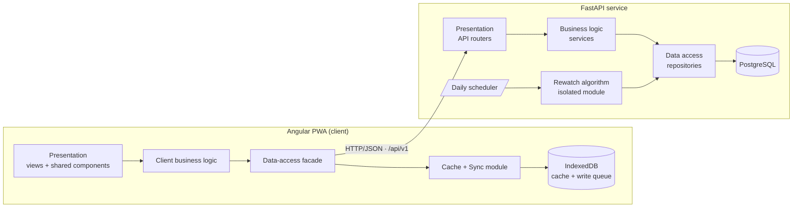
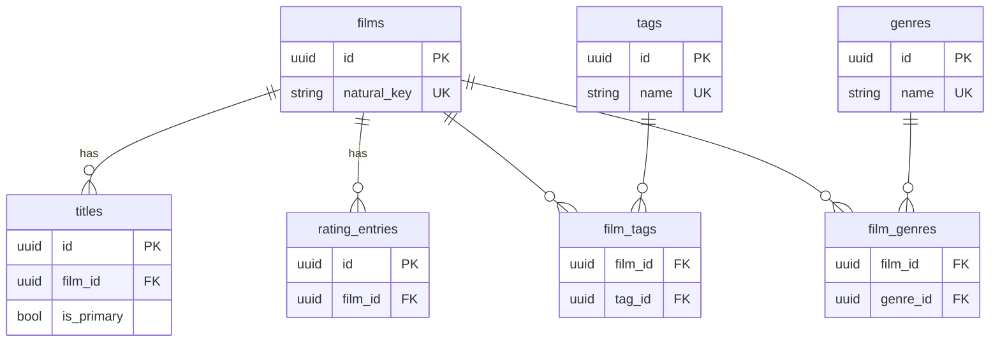
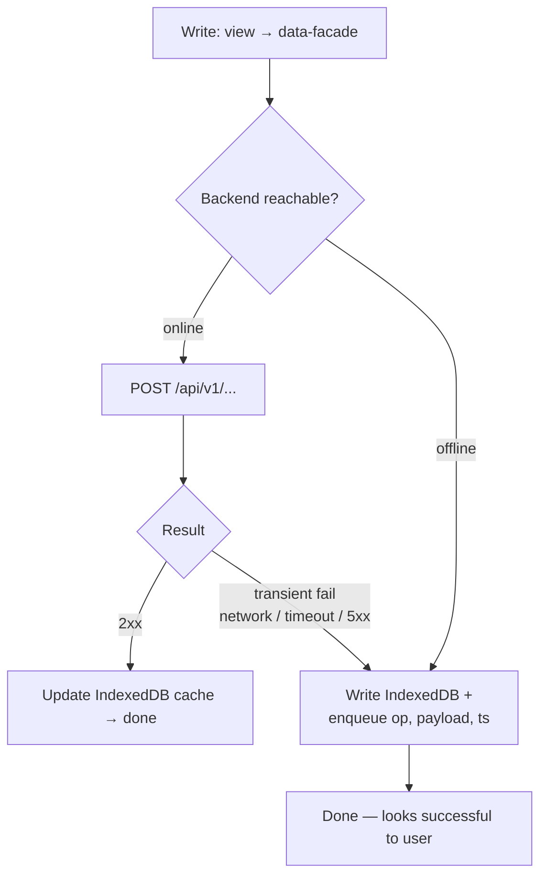
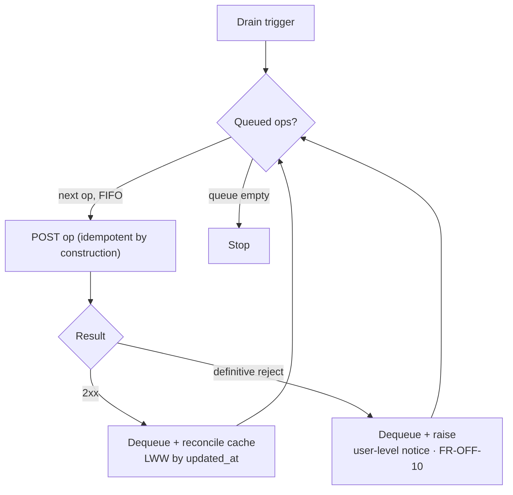

# Technical Design Document — Film Tracker Web Application

**Version:** 1.0  
**Status:** Approved  
**Created:** 2026-05-30  
**Last updated:** 2026-06-05  
**Companion to:** [REQUIREMENTS_V1.md](../requirements/REQUIREMENTS_V1.md) · [FUTURE_WORK_V1.md](../requirements/FUTURE_WORK_V1.md) · [OPEN_DECISIONS_V1.md](../requirements/OPEN_DECISIONS_V1.md)  

---

## Table of Contents

- [Technical Design Document — Film Tracker Web Application](#technical-design-document--film-tracker-web-application)
  - [Table of Contents](#table-of-contents)
  - [1. Purpose \& Scope of This Document](#1-purpose--scope-of-this-document)
  - [2. Technology Stack](#2-technology-stack)
  - [3. System Architecture](#3-system-architecture)
  - [4. Repository Layout](#4-repository-layout)
  - [5. Backend Design](#5-backend-design)
    - [5.1 Layered Structure (FastAPI backend)](#51-layered-structure-fastapi-backend)
    - [5.2 Data Persistence \& Models](#52-data-persistence--models)
    - [5.3 API Surface](#53-api-surface)
    - [5.4 Validation \& Error Handling](#54-validation--error-handling)
    - [5.5 Idempotency \& Conflict Resolution](#55-idempotency--conflict-resolution)
    - [5.6 Integration Adapter Pattern](#56-integration-adapter-pattern)
    - [5.7 Type Safety](#57-type-safety)
    - [5.8 Rewatch Suggestion Engine](#58-rewatch-suggestion-engine)
  - [6. Frontend Design](#6-frontend-design)
    - [6.1 Layered Structure (Angular client)](#61-layered-structure-angular-client)
    - [6.2 Cache-First Data Layer \& Sync Queue](#62-cache-first-data-layer--sync-queue)
    - [6.3 Rewatch View Data Flow](#63-rewatch-view-data-flow)
    - [6.4 PWA \& Service Worker](#64-pwa--service-worker)
    - [6.5 Views \& Navigation](#65-views--navigation)
  - [7. Offline \& Sync — End-to-End Flow](#7-offline--sync--end-to-end-flow)
  - [8. Configuration \& Deployment](#8-configuration--deployment)
    - [8.1 Tooling \& Infrastructure](#81-tooling--infrastructure)
    - [8.2 Deployment Target](#82-deployment-target)
  - [9. Testing Strategy](#9-testing-strategy)
  - [10. Delivery Plan (Milestones)](#10-delivery-plan-milestones)
  - [11. Deferred \& Open Decisions](#11-deferred--open-decisions)

---

## 1. Purpose & Scope of This Document

The [requirements document](../requirements/REQUIREMENTS_V1.md) defines *what* the application must do and the binding
architectural principles it must obey. This document defines *how* those requirements are realised: the concrete technology stack, the
physical code structure that enforces the layering, the API contract, and the sequence in which the system is
built.

Every significant decision below is traceable to a requirement (referenced as `FR-*` / `NFR-*` / `§n`). Where a
requirement deliberately leaves something open (search/filter UX, breakpoints, performance targets), this
document does not close it prematurely.

---

## 2. Technology Stack

| Concern              | Choice                                      | Primary requirement drivers                                                             |
| -------------------- | ------------------------------------------- | --------------------------------------------------------------------------------------- |
| Frontend framework   | **Angular** (standalone components)         | §7 three-view SPA; §3.1 layering; FR-EXT-01..03 reusable components; strong PWA tooling |
| Frontend language    | TypeScript                                  | Type-safe data model shared across layers                                               |
| Local store (client) | **IndexedDB** (via a typed wrapper)         | NFR-DATA-02, NFR-OFF-04 durable cache + persistent sync queue                           |
| PWA                  | Angular Service Worker (`@angular/pwa`)     | FR-OFF-02, NFR-OFF-01/02 installable, offline shell, Lighthouse PWA ≥ 90                |
| UI components        | **Angular Material**                        | §7 nav (drawer/bottom-bar, §6.5), dialogs, forms, date picker; accessible (WCAG AA, NFR-A11Y-01); reusable components (FR-EXT-03) |
| Backend framework    | **Python + FastAPI**                        | §3.2 API-first; NFR-MAINT-01 auto-generated OpenAPI; NFR-INT-03 validation              |
| Data validation      | **Pydantic v2**                             | §4 data-model constraints enforced server-side; feeds OpenAPI schema                    |
| ORM / data access    | **SQLAlchemy 2.x**                          | §3.1 data-access layer; stable interface, swappable engine                              |
| Migrations           | **Alembic**                                 | Schema evolution for FR-EXT-04 new fields                                               |
| Database             | **PostgreSQL**                              | NFR-DATA-01 authoritative server-side store (runs in a container on the laptop)         |
| API documentation    | OpenAPI / Swagger UI (FastAPI native)       | §3.2, NFR-MAINT-01                                                                      |
| Config               | Environment variables (`pydantic-settings`) | §3.5 config-over-code; NFR-MAINT-04 no hardcoded config                                 |

**Notes on the database choice.** Postgres is the authoritative store, running in a container on the laptop (§8.2).
It was chosen during the stack discussion and is **confirmed**: SQLite was considered (and would also work for a
laptop-only deployment) but Postgres is the decision. Because all database access is mediated by the
SQLAlchemy-based data-access layer (§3.1), the engine stays an implementation detail — switching later would
require changes only inside the data-access layer.

---

## 3. System Architecture

The system is a **two-tier** application: an Angular Progressive Web App (the client) and a FastAPI service (the
backend), communicating exclusively over a versioned HTTP/JSON API (§3.2). The client additionally maintains a
durable local store that acts as a read-through cache and an offline write queue (§3.7).



Both tiers independently honour the **layered architecture** of §3.1: no presentation code touches storage
directly, and business logic is unaware of transport or storage details.

The **rewatch algorithm runs on the backend** as a once-daily scheduled job (see [§5.8](#58-rewatch-suggestion-engine)
and [§6.3](#63-rewatch-view-data-flow)). It produces the ordered list of currently-due films, which is persisted
and served via a dedicated endpoint; the client caches that result and renders it. Because the job runs only daily,
a film that becomes **newly due** by the passage of time first appears at the next run — an accepted ~24h lag, even
when online. The opposite case is handled immediately on the client: watching a film in the list **optimistically
removes** it (§6.3), since it won't be due again for a while. Offline staleness is separate and general: like all
cached data, the list is only as current as the last successful backend connection (§6.2) —  refreshes it.

---

## 4. Repository Layout

A single repository with two top-level applications:

```
FilmRewatchApp/
├── docs/                     # REQUIREMENTS, DESIGN, FUTURE_WORK, OPEN_DECISIONS (+ milestones)
├── backend/
│   ├── app/
│   │   ├── films/           # one self-contained domain module (shape shown below)
│   │   │   ├── router.py    #   presentation — FastAPI routes (/api/v1/films/*)
│   │   │   ├── service.py   #   business logic — validation, natural-key, dup-detect, merge
│   │   │   ├── repository.py#   data access — SQLAlchemy behind a stable interface
│   │   │   ├── models.py    #   SQLAlchemy ORM models
│   │   │   ├── schemas.py   #   Pydantic request/response schemas
│   │   │   └── dependencies.py
│   │   ├── ratings/         # same shape — add/delete, average computation
│   │   ├── tags/            # same shape — autocomplete, orphan cleanup
│   │   ├── genres/          # same shape — autocomplete, orphan cleanup
│   │   ├── rewatch/         # isolated algorithm module (§3.3) + daily scheduler + router
│   │   ├── adapters/        # Optional external integrations (e.g. TMDB) — §3.4
│   │   ├── core/            # Config, DB session, error schema, idempotency, shared deps
│   │   └── main.py          # App factory, CORS, wires each module's router
│   ├── migrations/          # Alembic
│   ├── tests/
│   └── pyproject.toml
├── frontend/
│   └── (Angular workspace)
│       └── src/app/
│           ├── core/             # cross-cutting infra: HTTP client, cache+sync engine (§3.7), config, errors
│           ├── shared/           # reusable dumb UI components + display pipes (rating→stars) — FR-EXT-03
│           ├── domain/           # per-ENTITY modules (mirror the backend) — business logic + data access
│           │   ├── film/         #   model.ts, validators.ts, mapper.ts, api.ts, facade.ts
│           │   ├── rating/       #   (same shape)
│           │   ├── tag/
│           │   └── genre/
│           └── views/            # the 3 screens — presentation; each composes domain facades into ViewModels
│               ├── rewatch/      #   Rewatch Suggestion view (+ optimistic removal)
│               ├── library/      #   Search & Filter + Add Film
│               └── film-detail/  #   Film Detail view
└── README.md                     # Run/test/API-docs pointers — NFR-MAINT-05
```

Both tiers are **feature-based** and organised the same way. The backend splits each domain module into
`router → service → repository` (presentation → business logic → data access; a router never imports a
repository). The frontend mirrors this: business logic + data access live in **per-entity** `domain/*` modules,
while the three screens live in `views/*` and compose them (details in §6.1). This gives FR-EXT new work a
predictable home: a new screen is a new `views/*` folder, a new entity a new `domain/*` module (FR-EXT-01/02), and
a new adapter a new `adapters/*` module (FR-EXT-08).

---

## 5. Backend Design

### 5.1 Layered Structure (FastAPI backend)

The layers are realised as files **within each feature module** (e.g. `app/films/router.py`, `service.py`,
`repository.py`), not as top-level folders:

| Layer          | File (per module) | Responsibility                                                             | Forbidden from                   |
| -------------- | ----------------- | -------------------------------------------------------------------------- | -------------------------------- |
| Presentation   | `router.py`       | HTTP routing, request/response (de)serialisation, status codes             | Business rules; direct DB access |
| Business logic | `service.py`      | Validation, average rating, duplicate detection, merge, orphan tag/genre cleanup | HTTP concerns; SQL/ORM specifics |
| Data access    | `repository.py`   | CRUD over the ORM behind a stable interface                                | Business rules; HTTP             |

Within a module, the router depends on the service; the service depends on a repository interface (injected via
FastAPI dependencies). This satisfies NFR-MAINT-02 (no business logic in route handlers or queries) and lets the
data-access implementation change without touching business logic. Cross-module calls go service-to-service, never
into another module's repository.

### 5.2 Data Persistence & Models

§4 already lists every field and rule. This section only covers what is **new at the database level**: how those
entities become Postgres tables, what the database stores versus computes, and how the harder rules are enforced.

The seven tables and how they relate (keys only — full fields live in §4):



**How the §4 entities become tables.** A film's list of titles and its rating history each become their *own*
table (`titles`, `rating_entries`), linked back to `films` by a `film_id` foreign key — rather than being packed
into the film row — so they can be queried and constrained independently. **Tags and genres are modelled
identically**: each is a shared entity table holding every distinct label once (`tags`, `genres`), connected to
films by a many-to-many **join table** (`film_tags`, `film_genres`). So "Drama" — like the tag "comfort-film" —
is stored once and reused, which keeps casing consistent for exact-match genre filtering (FR-SF-07) and enables
genre autocomplete the same way tags get it. Genres stay free text, not an enum (§4.1): the user types any genre,
and it is created if new or reused if it already exists (mirroring FR-TAG-01). This enriches genre beyond §4's
plain `List<String>` — flagged for the requirements reconciliation (§11).

**What the database stores vs. computes.** `average_rating` is **not a column** — it is recalculated from the
film's ratings every time it is read (FR-RAT-09/10). Storing it could show a stale value; computing it keeps it
always correct (NFR-INT-01). `natural_key` **is** a column (it backs the "no duplicate films" rule), but the user
never types it: the business layer builds it from primary title + release year + director, and rebuilds it
whenever one of those changes (FR-LIB-04/08).

**How the trickier rules are enforced.**

- *No two tags — or genres — with the same name, ignoring case* → a unique index on `lower(name)` on each table.
- *Exactly one primary title, and at most one original, per film* → a database constraint plus a service-layer
  check (§4.1).
- *No duplicate films* → a unique constraint on `natural_key`.
- *Deleting a film removes its ratings, tag links, and genre links* → foreign keys with `ON DELETE CASCADE`; a
  tag or genre then left on no films is deleted by the business layer (FR-TAG-04, FR-LIB-12).

### 5.3 API Surface

All endpoints are namespaced under `/api/v1` (§3.2, FR-EXT-11) and documented automatically via OpenAPI.

| Method & Path                 | Purpose                                                                    | Requirements                   |
| ----------------------------- | -------------------------------------------------------------------------- | ------------------------------ |
| `GET /films`                  | List/search/filter/sort films (query params)                               | FR-SF-01..11                   |
| `POST /films`                 | Create film (+ **required** first rating)                                  | FR-LIB-01..04, FR-LIB-03       |
| `POST /films/duplicate-check` | Background duplicate probe by natural-key parts                            | FR-LIB-05                      |
| `GET /films/{id}`             | Fetch one film (with titles, tags, genres, rating history)                 | §7.3                           |
| `PATCH /films/{id}`           | Edit user-editable fields                                                  | FR-LIB-06..09                  |
| `DELETE /films/{id}`          | Delete film (cascade ratings; orphan tag/genre cleanup)                    | FR-LIB-10..12                  |
| `POST /films/{id}/merge`      | Merge a duplicate into this film                                           | FR-LIB-17..21                  |
| `POST /films/{id}/ratings`    | Add a rating entry                                                         | FR-RAT-01..04                  |
| `DELETE /ratings/{id}`        | Delete a rating entry; deleting the **last** one deletes the film          | FR-RAT-07                      |
| `GET /tags`                   | List tags (supports `?prefix=` for autocomplete)                           | FR-TAG-06                      |
| `GET /genres`                 | List genres (supports `?prefix=` for autocomplete)                         | FR-SF-07 (filter/autocomplete) |
| `GET /rewatch-suggestions`    | Latest daily-computed due-list (`film_id` + `days_until_rewatch`, ordered) | FR-RW-*, §5.8                  |

Tags and genres are **created implicitly** through film create/edit payloads (FR-TAG-01: a tag never exists
standalone; the same applies to genres, §5.2). `GET /tags` and `GET /genres` are read-only lookups for filtering
and autocomplete. There is intentionally **no bulk-delete endpoint** for tags or genres in this version: a label
is removed per-film via `PATCH /films/{id}`, and orphan-cleanup (FR-TAG-04) deletes it once it has no films left.
The global "delete this tag everywhere" action (FR-TAG-05) is **deferred** — it needs a management/settings UI
that the three-view plan (§7) doesn't include (§11).
`GET /rewatch-suggestions` serves the **stored result of the daily job** (§5.8) — it does not run the algorithm
on request; the client caches this list for offline rendering.

**Invariant — every film has at least one rating.** The library only holds films the user has actually watched,
so `POST /films` *requires* a first rating (the create payload's `first_rating` is mandatory, not optional), and
`DELETE /ratings/{id}` on a film's **last** remaining rating deletes the **whole film** (cascading to its tag and
genre links per FR-LIB-12) behind an explicit confirmation that names the film, not just the rating. This makes
`rating_history` never empty, so `average_rating` is never null and the "Not yet rated" / empty-history states
(FR-RAT-11, §7.3 Section B) cannot occur, and the rewatch inputs (FR-RW-02) never see a null/zero watch count. One
consequence for FR-RAT-08 (ratings are corrected by delete-then-recreate): to fix a film's *only* rating, the new
one must be added first, then the wrong one deleted — deleting first would remove the film.

For required search (initial version), `GET /films` accepts `title` and `director` query params (substring,
case-insensitive, AND-combined; FR-SF-01..03). The handler reads from a **filter registry** so optional
dimensions (tags, genre, year range, min rating, sort) can be added by registering a new filter rather than
rewriting the endpoint (FR-EXT-05).

### 5.4 Validation & Error Handling

- **Validation** is expressed once as Pydantic schemas and enforced server-side authoritatively (NFR-INT-03):
  `release_year` 1888–current, rating `value` 0.5–5.0 in 0.5 steps, `watch_date` not future, poster URL ≤ 2048,
  ≥ 1 title/genre/tag, exactly one primary title, at most one original title. The same constraints are mirrored in
  Angular for immediate feedback, but the server is the source of truth.
- **Error schema** (NFR-MAINT-03): every error response is `{ "error": { "code": "...", "message": "..." } }`,
  produced by a single FastAPI exception handler. Domain errors (e.g. `DUPLICATE_FILM`, `FUTURE_WATCH_DATE`,
  `VALIDATION_ERROR`) map to stable `code` values.

### 5.5 Idempotency & Conflict Resolution

The offline sync queue may replay a write whose first attempt actually succeeded (NFR-OFF-05), so every write must
be replay-safe. This is achieved **without a separate idempotency key** — each write is idempotent by construction:

- **Client-minted entity UUIDs** make creates idempotent. The client generates a film/rating's `id` (a surrogate
  UUID) at write time — keeping the id system-managed and never user-entered (FR-LIB-04 intent) — so replaying a
  create for an existing `id` returns the existing record instead of duplicating it.
- **Natural idempotency covers the rest.** Tag/genre creates dedupe on the case-insensitive unique `name`;
  assigning an already-present link or removing an absent one is a no-op (unique join + delete semantics); edits
  are idempotent under last-write-wins (below). A replayed operation therefore lands on the same end state.
- **Natural-key dedup** remains the user-facing duplicate guard (FR-LIB-05).
- **Conflict resolution** is last-write-wins by `updated_at` (FR-OFF-09): the backend keeps the record with the
  later `updated_at`. Definitive rejections (e.g. editing a record deleted elsewhere) return a stable error code
  the client surfaces per FR-OFF-10.

### 5.6 Integration Adapter Pattern

External metadata lookup (e.g. TMDB) is realised as an **optional adapter** in `app/adapters/` implementing a
small interface (`search(query) -> list[FilmDraft]`). It is additive: core create/edit logic never imports an
adapter. Adapters are toggled via a feature flag (§3.5, FR-EXT-06..08); with no adapter active, manual entry is
fully functional.

### 5.7 Type Safety

The backend is strongly typed at two complementary layers:

- **Runtime, at the API boundary — Pydantic v2 in strict mode.** All request/response schemas inherit from a
  shared base model configured `strict=True` (no lossy coercion: a JSON `"1999"` is rejected for an `int` field)
  and `extra="forbid"` (unknown payload fields are rejected, not silently ignored). ISO-8601 strings are still
  accepted for `date`/`datetime`/`UUID` fields, since JSON has no native representation for those.
- **Static, across all code — mypy (or pyright) in strict mode, run locally.** Pydantic only guards data crossing
  the boundary; the services, repositories, and helpers are covered by a static type checker in `--strict` mode,
  which flags missing annotations, `Any` leakage, and unchecked `None`. Run locally (editor + a `make`/script
  target).
- **ORM models are typed too** via SQLAlchemy 2.x `Mapped[...]` columns, so nullability and column types are
  visible to the static checker (e.g. `poster_image: Mapped[str | None]`).

Together these give runtime guarantees at the edges and compile-time guarantees everywhere else. The strict
configuration is established in M0 so it is enforced from the first commit rather than retrofitted.

### 5.8 Rewatch Suggestion Engine

The rewatch algorithm lives on the backend as an **isolated, self-contained module** — the `app/rewatch/` feature
module, with the scoring logic in a pure inner module (e.g. `app/rewatch/algorithm.py`) — satisfying §3.3: it has
no dependency on the API or data-access layers. The module's `service.py` assembles the FR-RW-02 per-film payload,
passes it to the pure algorithm, and persists the result. Replacing the algorithm touches only this module
(FR-EXT-09); additional algorithms can be added as siblings selected by config (FR-EXT-10).

- **Output contract (refined from FR-RW-03/04).** The module returns an **ordered list of due films only** —
  each entry `{ film_id, days_until_rewatch }` with `days_until_rewatch <= 0` (0 = due today, negative =
  overdue), sorted ascending so the **most overdue appears first**. Films not yet due are omitted. This is a
  deliberate deviation from the written requirements (see §11).
- **Trigger — a once-daily scheduled job.** The algorithm runs once per day; its result is **persisted** (a
  `rewatch_suggestions` projection) and served verbatim by `GET /api/v1/rewatch-suggestions`. Because it
  recomputes daily, the result reflects the data as of the last run — so a film that becomes **newly due** by the
  passage of time first surfaces at the next run (an accepted ~24h lag, even online). The reverse — a watched film
  leaving the list — is handled immediately by the client (§6.3), so it does not wait for the next run. The daily
  cadence also removes any need for per-request computation or client-side time-decay correction. (Offline
  staleness on top of this is the general cache behaviour of §6.2, not specific to this feature.)
- **Scheduler.** Implemented as a scheduled task (e.g. a container/cron job or in-process scheduler invoking the
  module) — see §8.1. The scheduler is infrastructure; the algorithm module itself stays pure and unaware of it.

---

## 6. Frontend Design

### 6.1 Layered Structure (Angular client)

The client's internal layering (the backend's is §5.1). It honours the same three §3.1 layers; the cache/sync
module (§3.7) is an isolated implementation *behind* the data-access layer, not a fourth layer. Calls flow
**downward only** — presentation calls business logic, business logic calls data access; data returns upward.

| Layer          | Location                               | Responsibility                                                                                                                                                    |
| -------------- | -------------------------------------- | ----------------------------------------------------------------------------------------------------------------------------------------------------------------- |
| Presentation   | `views/*`, `shared/*`                  | Components, templates, user input. Calls business-logic facades **only** — never the data layer. Holds no rules.                                                  |
| Business logic | `domain/<entity>/*` + per-view facades | The single API the views call: validation, DTO↔domain mapping, ViewModel projection, client-only rules (e.g. optimistic removal, §6.3); orchestrates data access. |
| Data access    | `domain/<entity>/api.ts` + `core/data` | Typed per-entity backend calls on top of the shared cache-first + sync engine.                                                                                    |

Mirroring the backend, business logic and data access are organised **per entity** (`domain/film/`, `rating/`,
`tag/`, `genre/`) — not in one flat bucket — while the three **screens** live in `views/*` (`rewatch`, `library`,
`film-detail`) and compose those entity modules.

**Three models, two mappings.** The shape the UI needs is not the shape the backend sends, so data passes through
three representations:

| Model            | Shape                                         | Owned by                             | Example                                                     |
| ---------------- | --------------------------------------------- | ------------------------------------ | ----------------------------------------------------------- |
| **DTO**          | exact wire shape to/from the backend          | data access                          | `FilmDto { release_year, poster_image, tags: string[] }`    |
| **Domain model** | canonical app-wide `Film` (incl. tags/genres) | business logic — *shared per entity* | `Film { releaseYear, posterUrl, tags: Tag[] }`              |
| **ViewModel**    | display-ready, shaped for one screen          | business logic — *per view*          | `RewatchCardVm { posterUrl, title, year, stars, dueLabel }` |

- **Read:** `DTO → Domain → ViewModel` — backend data becomes display-ready.
- **Write:** `form input → validate → Domain → DTO` — user data is verified on the way out.

**Validation vs. projection.** Validators belong to the **shared domain model** — the Film rules (§5.4) are
app-wide constants, defined once per entity and reused by every form; they are the client mirror of the backend's
Pydantic schemas. **ViewModel projection is per view** — each screen's facade maps the domain model into its own
ViewModel. Purely UI-only input (e.g. a "type DELETE to confirm" field, a search box's non-empty check) is
validated *in the view*, not by the domain validators.

Behind the data-access layer sits the **isolated cache + sync module** (`core/data` + `core/sync`, §3.7) — an
IndexedDB read-through cache + persistent write queue. It is the swappable implementation the data layer delegates
to (see the §3 diagram), not a peer layer. Views never know whether data came from network or cache (FR-OFF-01,
FR-OFF-12); everything below the data-access layer is replaceable without touching views (§3.7 isolation).

### 6.2 Cache-First Data Layer & Sync Queue

- **Reads:** facade attempts the backend, populates IndexedDB on success, and transparently falls back to
  IndexedDB when the backend is unreachable (FR-OFF-01). If neither can satisfy a read, the view shows a neutral
  "currently unavailable" message (FR-OFF-04) — never a blank/empty result.
- **Writes:** always appear immediately successful (NFR-DATA-03). Online → sent to backend, cache updated.
  Offline *or* transient failure → committed to IndexedDB and appended to the durable sync queue, silently
  (FR-OFF-05, NFR-REL-01). The user never sees the distinction or any connectivity indicator (FR-OFF-12/13).
- **Queue draining** is automatic on the `online` event, on app focus/visibility, and opportunistically after
  any successful request (FR-OFF-14). FIFO ordering by original write timestamp (FR-OFF-07/08). No manual
  "Sync now" (FR-OFF-15).
- The sync module sits behind a stable interface so its strategy (batching, retry/backoff) can be swapped
  without touching UI or business logic (FR-EXT-14).

### 6.3 Rewatch View Data Flow

The algorithm itself runs on the backend (§5.8); the client only **consumes** its result. The Rewatch view reads
the due-list from `GET /api/v1/rewatch-suggestions` through the data-access facade, which caches it in IndexedDB
like any other read. Each suggestion's `film_id` is joined to the cached film metadata to render the card.

- **Order is fixed** — rendered in the algorithm's order (most-overdue first); the client never re-sorts
  (FR-RW-04).
- **Filtering is allowed (future, not first release).** The list may be *filtered* by film attributes (tag,
  genre, director, …): a filter only **removes** non-matching films and preserves the algorithm's order among
  those that remain — a subset, not a re-sort, so it does not conflict with FR-RW-04. It would run client-side
  over the cached due-list (joining each `film_id` to its cached metadata) and **reuse the Search & Filter
  registry** (FR-EXT-05) rather than a second mechanism. See §11.
- **Optimistic removal on watch.** When a new watch (RatingEntry) is logged for a film currently in the cached
  due-list — from anywhere in the app — the client immediately removes that film from the list, because a
  freshly watched film won't be due again for a while. This is a local update to the cached due-list only; the
  daily job (§5.8) stays authoritative and reflects the same removal at its next run. It applies offline too (the
  watch is queued; the removal still shows). It is self-correcting: if the algorithm would in fact keep the film
  due, the next daily fetch restores it.
- **Online,** the list otherwise reflects the last daily run, so newly-due films can be up to ~24h behind (§5.8).
- **Offline,** the view shows the last cached due-list (FR-OFF-01); its age is however long since the last
  successful connection (not bounded by 24h). The view re-reads automatically on open — refetching the latest
  daily-computed list when online, re-reading the cache when offline; there is no manual refresh action (§7.1).
- **Empty** (no due films) and **error** (suggestions unavailable) states are handled per FR-RW-06/07 without
  affecting the rest of the app.

### 6.4 PWA & Service Worker

Angular's service worker caches the app shell + static assets on install (NFR-OFF-02) and enables installability
for a Lighthouse PWA score ≥ 90 (FR-OFF-02, NFR-OFF-01). Data is **not** cached by the service worker — data
lives in IndexedDB under the cache/sync module (clear separation of asset cache vs. data cache). Poster images
rely on the browser/SW HTTP cache on a best-effort basis (FR-OFF-03).

### 6.5 Views & Navigation

Three routed views (§7): `rewatch`, `library` (Search & Filter + Add Film), and `film/:id` (Detail). Only **two**
are primary navigation destinations — **Rewatch** and **Library**; the Film Detail view is reached *contextually*
by selecting a film, and **Add Film** is an action inside the Library view (§7.2), not a nav destination. Routes
are driven by a **route registry** so new views can be added without editing existing entries (FR-EXT-02). Shared
presentational components — film card, rating stars, tag chip, poster-with-placeholder — live in `shared/` for
reuse across views (FR-EXT-03), each meeting WCAG 2.1 AA (NFR-A11Y-01..04).

The navigation element **adapts by viewport**, switching at the responsive breakpoint (exact value deferred to the
responsive-design work, §7.4):

**Desktop — permanent navigation drawer.** A left sidebar pinned open (Angular Material `mat-sidenav`,
`mode="side"`) that pushes the content beside it, listing the primary destinations as icon + text label. It has
room to grow for a future settings/management screen (e.g. the deferred global tag/genre delete, §11). This is a
deliberate change from §7.4's "top bar (desktop)" — recorded in §11.

**Mobile — bottom navigation bar.** A thumb-reachable bar fixed to the bottom holding the primary destinations —
always visible, one tap (chosen over a hamburger for reachability and discoverability with so few destinations).
**Add Film** appears as a floating action button (§7.2). The drawer is *not* reused on mobile in the first
release; if a hamburger/modal drawer is wanted later, the same `mat-sidenav` switches to `mode="over"` at the
mobile breakpoint with no restructuring.

---

## 7. Offline & Sync — End-to-End Flow

**Write path** (e.g. add a rating) — always appears immediately successful:



**Drain path** — triggered automatically (`online` event · app focus/visibility · post-success piggyback), FIFO:



No step exposes connectivity, the queue, or the cache to the user (FR-OFF-12/13/15). The only user-visible
failure path is a definitive backend rejection (FR-OFF-10).

---

## 8. Configuration & Deployment

**Deployment target — the user's laptop, in Docker.** This version commits to a **single** deployment: the backend
and PostgreSQL run in Docker on the user's laptop; the desktop browser and the mobile PWA (on the same Wi‑Fi) reach
it there. The requirements' "also runs on an always-on remote server / deployment-agnostic" scope (§3.6,
FR-EXT-13, NFR-OFF-06, and the two-topology framing of §1.3 / §2.2) is **dropped for now** — recorded in §11. This
narrows only *deployment*: the **offline-first** behaviour (§5.6, §6.2) is unaffected, since the mobile device is
still frequently off-network from the laptop.

**Backend config (env vars, `pydantic-settings`).** `DATABASE_URL`, `CORS_ALLOWED_ORIGINS`, host/port, and feature
flags (e.g. `FEATURE_TMDB_ADAPTER`) are read from the environment — nothing environment-specific is hardcoded
(NFR-MAINT-04, §3.5). Still worthwhile with one target: it keeps secrets out of code and the laptop setup
reproducible.

**Frontend → backend wiring.** The API base URL is **hard-coded in the Angular build** (`environment.ts`),
pointing at the backend's address on the laptop — the LAN address (not `localhost`) so the mobile PWA can reach it.
Because the app and the API are then on different origins, the backend's `CORS_ALLOWED_ORIGINS` (above) must
include the frontend's origin; repointing at a different backend means rebuilding the frontend.

### 8.1 Tooling & Infrastructure

How the application is packaged and run, distinct from the building blocks in §2:

- **Docker + Docker Compose.** The backend is packaged as a Docker image and run with PostgreSQL as a single
  Compose stack on the laptop (`docker compose up`).
- **Frontend** is built to static assets (Angular production build) and served on the laptop; its API base URL is
  hard-coded in the build (§8 wiring).
- **Scheduler.** A scheduled task runs the once-daily rewatch recompute (§5.8).
- **Checks** — tests (§9) and the strict type checks (§5.7) run locally (editor + a `make`/script target).

Remaining infrastructure choices (e.g. the scheduler mechanism) are tracked in
[OPEN_DECISIONS](../requirements/OPEN_DECISIONS_V1.md).

> Infrastructure/tooling is *how the app runs*, not a building block it is written with — hence it is not in the §2
> technology-stack table.

### 8.2 Deployment Target

A single target: the **user's laptop**. The run stack (backend + PostgreSQL via Docker Compose — §8.1) runs on the
laptop. The **desktop browser** uses it locally, and the **mobile PWA** reaches it at the laptop's LAN address (the
hard-coded API base URL — §8 wiring) and syncs when on the same Wi‑Fi. When the laptop is off or the phone is
off-network, the PWA keeps working from its cache (§5.6, §6.2).

---

## 9. Testing Strategy

- **Backend unit tests** per layer: services tested against fake repositories (no DB) for business rules
  (average rating, duplicate detection, merge, orphan tag/genre cleanup); repository tests against a real Postgres.
- **Backend API/contract tests** asserting the OpenAPI schema and the §NFR-MAINT-03 error envelope.
- **Frontend unit tests** for the cache/sync module (online/offline/transient-fail/drain paths), the Rewatch
  view's consume-and-render path (incl. offline-cached fallback), and shared components.
- **Rewatch algorithm module** (backend) tested in isolation against the FR-RW-02 input / §5.8 output contract —
  including the due-only filter (`<= 0`) and most-overdue-first ordering.
- **PWA**: Lighthouse check gating the NFR-OFF-01 ≥ 90 target.

---

## 10. Delivery Plan (Milestones)

Backend-first, then the online happy path, then offline/sync last — offline is the hardest work and benefits
from a stable foundation beneath it. Note that **film, rating, tag, and genre ship as one core milestone**: a valid
`POST /films` requires a first rating *and* ≥1 tag *and* ≥1 genre (§5.3, FR-LIB-01), so there is no working
create-film slice without all four — they cannot be sequenced separately.

This table is a **rough overview only** — detailed per-milestone definitions live in a separate planning document.

| #   | Milestone                  | Delivers                                                                                                                                | Key requirements                                             |
| --- | -------------------------- | --------------------------------------------------------------------------------------------------------------------------------------- | ------------------------------------------------------------ |
| M0  | Scaffolding                | Repo skeletons, config, Docker Compose stack, OpenAPI served, strict type-safety setup                                                  | §3.5, §4 layout, §5.7, §8.1, NFR-MAINT-05                    |
| M1  | Core domain (backend)      | Film + Rating + Tag + Genre modules; watched-only create flow, validation, duplicate detection, averages, cascade/orphan cleanup; tests | FR-LIB-01..16, FR-RAT-*, FR-TAG-*, §5.2, §5.3, NFR-INT/MAINT |
| M2  | Search (backend)           | Title + director search via the extensible filter registry                                                                              | FR-SF-01..05, FR-EXT-05                                      |
| M3  | Angular shell (online)     | Three views + adaptive nav + shared components, wired online-only                                                                       | §7.1-7.4, FR-EXT-01..03                                      |
| M4  | Rewatch engine             | Backend rewatch module + daily scheduler + endpoint; Rewatch view renders the due-list                                                  | FR-RW-01..07, §5.8, §7.1                                     |
| M5  | Cache & PWA                | IndexedDB cache, service worker, installable PWA (Lighthouse ≥ 90)                                                                      | FR-OFF-01..04, NFR-OFF-01/02                                 |
| M6  | Offline writes & sync      | Durable write queue, auto-drain, idempotency, LWW conflicts                                                                             | FR-OFF-05..15, NFR-OFF-04/05                                 |
| M7  | Merge, edit polish, extras | Film merge, inline edit, optional search dimensions, a11y pass                                                                          | FR-LIB-17..21, FR-SF-06..11                                  |
| M8  | Hardening & docs           | Error-schema audit, responsive/a11y QA, README + API docs                                                                               | NFR-MAINT-*, §3.4, §7.4                                      |

---

## 11. Deferred & Open Decisions

Deferred work and undecided items are tracked in two dedicated, living documents (moved out of this design doc):

- **[Future Work & Deferred Items](../requirements/FUTURE_WORK_V1.md)** — "maybe later" work intentionally out of scope for
  this version: global tag/genre delete (FR-TAG-05), Rewatch list filtering, CI/CD automation.
- **[Open Decisions](../requirements/OPEN_DECISIONS_V1.md)** — choices still to make: M0 confirmations (database engine,
  frontend→backend wiring, scheduler mechanism, IndexedDB wrapper), design points the requirements left open
  (search/filter UX, breakpoints, performance targets, rewatch algorithm internals), and requirement deviations
  to reconcile with REQUIREMENTS_V1.md (rewatch contract, genre-as-entity, watched-only library, single
  deployment target, desktop drawer).

Inline `§11` references elsewhere in this document point here — follow the relevant link above.
