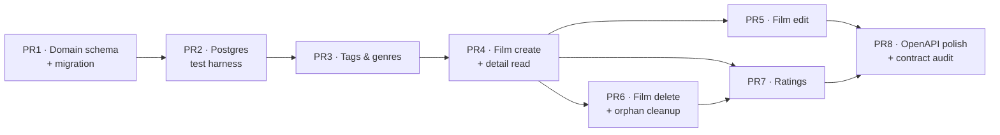

# Milestone M1 — Core Domain (Backend)

**Version:** 1.0  
**Status:** Draft  
**Created:** 2026-07-12  
**Last updated:** 2026-07-12  
**Companion to:** [DESIGN_V1.md](../designs/DESIGN_V1.md) · [REQUIREMENTS_V1.md](../requirements/REQUIREMENTS_V1.md) · [OPEN_DECISIONS_V1.md](../requirements/OPEN_DECISIONS_V1.md) · [FUTURE_WORK_V1.md](../requirements/FUTURE_WORK_V1.md)  
**Predecessor:** [MILESTONE_M0_V1.md](./MILESTONE_M0_V1.md) (complete)

This is the detailed definition of the second milestone in the delivery plan
([DESIGN §10](../designs/DESIGN_V1.md#10-delivery-plan-milestones)), which that table summarises in a single row.
It expands M1 into independently reviewable, separately-mergeable work items (one PR each).

---

## Table of Contents

- [Milestone M1 — Core Domain (Backend)](#milestone-m1--core-domain-backend)
  - [Table of Contents](#table-of-contents)
  - [1. Goal \& Scope](#1-goal--scope)
  - [2. Definition of Done (milestone exit criteria)](#2-definition-of-done-milestone-exit-criteria)
  - [3. Explicitly Out of Scope](#3-explicitly-out-of-scope)
  - [4. Work Items (PR breakdown)](#4-work-items-pr-breakdown)
    - [4.1 Summary](#41-summary)
    - [4.2 Dependency graph](#42-dependency-graph)
    - [PR1 — Domain schema \& first real migration](#pr1--domain-schema--first-real-migration)
    - [PR2 — Postgres-backed repository test harness](#pr2--postgres-backed-repository-test-harness)
    - [PR3 — Tags \& genres modules (lookups + shared service API)](#pr3--tags--genres-modules-lookups--shared-service-api)
    - [PR4 — Film create flow \& detail read](#pr4--film-create-flow--detail-read)
    - [PR5 — Film edit](#pr5--film-edit)
    - [PR6 — Film delete, cascade \& orphan cleanup](#pr6--film-delete-cascade--orphan-cleanup)
    - [PR7 — Rating endpoints \& the last-rating rule](#pr7--rating-endpoints--the-last-rating-rule)
    - [PR8 — OpenAPI polish \& M1 contract audit](#pr8--openapi-polish--m1-contract-audit)
  - [5. Suggested Sequencing](#5-suggested-sequencing)
  - [6. Requirement Coverage Matrix](#6-requirement-coverage-matrix)

---

## 1. Goal & Scope

M1 turns the M0 shell into a **working backend core domain**: the empty `films/`, `ratings/`, `tags/`, and
`genres/` stubs gain real models, services, repositories, and routes. By the end of M1 the API can — over the
[§5.3](../designs/DESIGN_V1.md#53-api-surface) surface, minus search and merge — log a watched film (create with
its mandatory first rating, tags, and genres in one operation), read it back in full, edit it, rate it again,
and delete it, with every rule of the data model ([REQUIREMENTS §4](../requirements/REQUIREMENTS_V1.md#4-data-model))
enforced server-side.

The four entity modules ship **in one milestone by design** ([DESIGN §10](../designs/DESIGN_V1.md#10-delivery-plan-milestones)):
a valid `POST /films` requires a first rating _and_ ≥1 tag _and_ ≥1 genre (FR-LIB-01/03), so there is no working
create-film slice without all four. The PR breakdown below still slices the work — that is possible because the
[§5.1](../designs/DESIGN_V1.md#51-layered-structure-fastapi-backend) layering lets schema, leaf modules, and flows
land bottom-up; the milestone is only _done_ when the whole create → read → edit → rate → delete loop works.

**Delivers (DESIGN §10 row M1):** Film + Rating + Tag + Genre modules · watched-only create flow · validation ·
duplicate detection · averages · cascade/orphan cleanup · tests.

**Key requirements:** `FR-LIB-01..16`, `FR-RAT-01..11`, `FR-TAG-01..04/06` (+ genre analogues,
[REQ §4.4](../requirements/REQUIREMENTS_V1.md#44-genre)), [§5.2](../designs/DESIGN_V1.md#52-data-persistence--models),
[§5.3](../designs/DESIGN_V1.md#53-api-surface), [§5.4](../designs/DESIGN_V1.md#54-validation--error-handling),
`NFR-INT-01..03`, `NFR-MAINT-01..03`.

---

## 2. Definition of Done (milestone exit criteria)

M1 is complete when **all** of the following hold (each is checked by at least one PR below):

- [ ] A fresh `docker compose up` applies the **seven-table migration** ([§5.2](../designs/DESIGN_V1.md#52-data-persistence--models))
      on top of the M0 empty baseline; `alembic revision --autogenerate` afterwards yields an **empty diff**
      (models and schema in sync).
- [ ] A film can be created **only together with** its first rating, ≥1 tag, and ≥1 genre — the watched-only
      library invariant (`FR-LIB-01/03`); the whole create commits **atomically**.
- [ ] `natural_key` is derived server-side from primary title + release year + director, recomputed on relevant
      edits, and **never appears** in any request or response (`FR-LIB-04/08`).
- [ ] Duplicate creation and colliding edits are **blocked** with a `DUPLICATE_FILM` error identifying the
      existing film; `POST /films/duplicate-check` answers the same question without side effects (`FR-LIB-05/09`).
- [ ] `GET /films/{id}` returns the full [§7.3](../requirements/REQUIREMENTS_V1.md#73-film-detail-view) projection —
      titles, genres, tags, rating history (most recent first), and an `average_rating` **computed from the
      history on every read**, never stored or stale (`FR-RAT-05/09/10`, `NFR-INT-01`).
- [ ] Edits update `updated_at`; `id` and `created_at` are never editable (`FR-LIB-07/08`).
- [ ] Deleting a film removes its titles, ratings, and tag/genre links **atomically** (`NFR-INT-02`); tags and
      genres left on no films are deleted (`FR-LIB-12`, `FR-TAG-04`).
- [ ] Ratings can be added (0.5–5.0 in 0.5 steps; no future `watch_date`) and deleted; deleting a film's **last**
      rating deletes the **whole film** (`FR-RAT-01..04/07`).
- [ ] `GET /tags` and `GET /genres` serve prefix-filtered lookups for autocomplete (`FR-TAG-06` + genre analogue).
- [ ] Every error response — including the new domain errors — uses the single envelope with **stable codes**
      (`NFR-MAINT-03`, [§5.4](../designs/DESIGN_V1.md#54-validation--error-handling)).
- [ ] Repository tests run against a **real Postgres** ([§9](../designs/DESIGN_V1.md#9-testing-strategy)); services
      are unit-tested against fake repositories; strict typecheck, lint, format, and tests are all green.
- [ ] OpenAPI documents the full M1 surface (`NFR-MAINT-01`).

---

## 3. Explicitly Out of Scope

M1 is a **backend-only** milestone delivering the core domain. The following are _not_ in M1; each is owned by a
later milestone (per [DESIGN §10](../designs/DESIGN_V1.md#10-delivery-plan-milestones)) and PRs here must not
drift into them:

| Deferred from M1                                                                                                                                                | Owned by                                         |
| --------------------------------------------------------------------------------------------------------------------------------------------------------------- | ------------------------------------------------ |
| `GET /films` — list/search/filter/sort, the filter registry, match counts (`FR-SF-*`, `FR-EXT-05`)                                                              | **M2**                                           |
| Any frontend work: views, forms, confirmation dialogs (`FR-LIB-11`, `FR-RAT-07` UI), poster placeholder (`FR-LIB-16`), autocomplete UI                          | **M3**                                           |
| Rewatch module, daily scheduler, `GET /rewatch-suggestions` (`FR-RW-*`) — the `is_favorite` / `delay_days` **columns** land here, their consumer does not       | **M4**                                           |
| IndexedDB cache, service worker, installable PWA                                                                                                                | **M5**                                           |
| Offline write queue, **idempotent replay semantics**, last-write-wins conflict resolution ([§5.5](../designs/DESIGN_V1.md#55-idempotency--conflict-resolution)) | **M6**                                           |
| Film **merge** (`FR-LIB-17..21`) — M1 only leaves the `DUPLICATE_FILM`-identifies-the-collision hook                                                            | **M7**                                           |
| Error-schema **audit**, responsive/a11y QA                                                                                                                      | **M8**                                           |
| Global tag/genre delete (`FR-TAG-05`), TMDB / external-metadata adapter                                                                                         | [Future Work](../requirements/FUTURE_WORK_V1.md) |

> **UI-facing halves.** Several M1 requirements have a UI half that M3 owns: the backend delivers the _semantics_
> (e.g. `DELETE /ratings/{id}` on a last rating deletes the film; the client-side confirmation naming the film is
> M3's job). The coverage matrix in §6 marks these "backend half".

---

## 4. Work Items (PR breakdown)

Eight PRs, bottom-up: schema first (PR1), test infrastructure (PR2), the leaf label modules (PR3), then the film
flows (PR4–PR6), ratings (PR7), and a contract-polish close-out (PR8). Each is independently reviewable; sizes are
rough (S ≈ hours, M ≈ a day, L ≈ multi-day).

### 4.1 Summary

| PR  | Title                                   | Delivers                                                                                        | Refs                                       | Depends on | Size |
| --- | --------------------------------------- | ----------------------------------------------------------------------------------------------- | ------------------------------------------ | ---------- | ---- |
| PR1 | Domain schema & first real migration    | 7 ORM tables, constraints, Alembic revision                                                     | §5.2, §5.7, REQ §4                         | —          | M    |
| PR2 | Postgres-backed repository test harness | DB test fixtures, per-test isolation, settings-cache fixture                                    | §9                                         | PR1        | S–M  |
| PR3 | Tags & genres modules                   | get-or-create, orphan-cleanup primitive, `GET /tags`/`GET /genres` `?prefix=`                   | FR-TAG-01..04/06, REQ §4.4, §5.2           | PR2        | M    |
| PR4 | Film create flow & detail read          | `POST /films` (+ first rating), dup detection, `POST /films/duplicate-check`, `GET /films/{id}` | FR-LIB-01..05, FR-RAT-05/06/09, §5.3, §5.4 | PR3        | L    |
| PR5 | Film edit                               | `PATCH /films/{id}`, natural-key recompute, dup block on edit, poster set/remove                | FR-LIB-06..09, FR-LIB-13..15               | PR4        | M    |
| PR6 | Film delete, cascade & orphan cleanup   | `DELETE /films/{id}`, atomic cascade, orphan label deletion                                     | FR-LIB-10..12, NFR-INT-02                  | PR4        | S–M  |
| PR7 | Rating endpoints & the last-rating rule | `POST /films/{id}/ratings`, `DELETE /ratings/{id}` (last → film delete)                         | FR-RAT-01..08, NFR-INT-01                  | PR4, PR6   | M    |
| PR8 | OpenAPI polish & M1 contract audit      | Documented error codes, envelope contract tests over the new surface, README refresh            | NFR-MAINT-01/03                            | all        | S    |

### 4.2 Dependency graph

---

### PR1 — Domain schema & first real migration

**Goal.** Turn the empty M0 baseline into the seven-table schema of
[§5.2](../designs/DESIGN_V1.md#52-data-persistence--models): ORM models registered on `Base.metadata` plus the
first real Alembic revision. This is the milestone's foundation — every rule the database can enforce is
enforced here.

**In scope**

- SQLAlchemy 2.x ORM models with `Mapped[...]` columns ([§5.7](../designs/DESIGN_V1.md#57-type-safety)), living in
  their feature modules' `models.py`: `films` + `titles` (films module), `rating_entries` (ratings module),
  `tags` + `film_tags` (tags module), `genres` + `film_genres` (genres module). Field definitions per
  [REQ §4.1–4.5](../requirements/REQUIREMENTS_V1.md#4-data-model) (incl. `is_favorite`, `delay_days`,
  `poster_image` nullable, UTC timestamps).
- The §5.2 database-level constraints: unique `natural_key` on `films`; unique index on `lower(name)` on `tags`
  and `genres`; constraints enforcing **exactly one primary** and **at most one original** title per film;
  `ON DELETE CASCADE` foreign keys on `titles`, `rating_entries`, `film_tags`, `film_genres`.
- **No** `average_rating` column — it is computed on read (§5.2, `NFR-INT-01`).
- One Alembic revision on top of `0001_baseline` creating all seven tables (upgrade + downgrade).
- **Retire the M0 guard**: replace `test_baseline_defines_no_tables` with its M1 successor — `Base.metadata`
  defines exactly the seven §5.2 tables, and autogenerate stays empty after upgrade.

**Out of scope.** Any service/endpoint logic (PR3+); CHECK-constraint duplication of service-layer validation
rules (value steps, year range — those are §5.4 schema/service concerns).

**Refs.** [§5.2](../designs/DESIGN_V1.md#52-data-persistence--models), [§5.7](../designs/DESIGN_V1.md#57-type-safety),
[REQ §4](../requirements/REQUIREMENTS_V1.md#4-data-model).

**Depends on.** —

**Acceptance criteria**

- [ ] `alembic upgrade head` on a fresh Postgres creates the seven tables (+ `alembic_version`); downgrade returns
      to the empty baseline.
- [ ] `alembic revision --autogenerate` after upgrade produces an **empty diff**.
- [ ] DB constraints hold: duplicate `natural_key`, case-insensitively duplicate tag/genre names, and a second
      primary title for the same film are all rejected by the database; deleting a film row cascades.
- [ ] Strict type-check passes with zero errors; the M0 empty-metadata guard test is replaced by the M1 version.

**Size.** M

---

### PR2 — Postgres-backed repository test harness

**Goal.** [§9](../designs/DESIGN_V1.md#9-testing-strategy) requires repository tests against a **real Postgres**;
M0's tests ran fully offline against a placeholder `DATABASE_URL`. Stand up the fixtures every following PR's
repository tests will use.

**In scope**

- Pytest fixtures providing a migrated Postgres schema (the composed Postgres or a dedicated test database) with
  **per-test isolation** (transaction rollback or equivalent), so repository tests are order-independent.
- A clear split between the offline test subset (services against fakes, schema tests) and DB-bound tests:
  DB-bound tests are marked and **skip cleanly with a reason** when no database is reachable; `make test` with the
  Compose stack up runs everything.
- A fixture clearing the `get_settings()` `lru_cache` between tests that override settings — the cached-settings
  interplay flagged in [REVIEW_M0](../../improvements/REVIEW_M0.md) (first M1 test wanting different settings
  would silently get the cached ones).

**Out of scope.** CI automation ([Future Work](../requirements/FUTURE_WORK_V1.md) — checks stay local).

**Refs.** [§9](../designs/DESIGN_V1.md#9-testing-strategy), [§8.1](../designs/DESIGN_V1.md#81-tooling--infrastructure).

**Depends on.** PR1 (migrations define the schema under test).

**Acceptance criteria**

- [ ] A sample repository round-trip test passes against the composed Postgres.
- [ ] With Postgres down, the DB-bound tests skip with a clear reason and the offline subset still passes.
- [ ] A test overriding a setting does not leak it into subsequent tests.
- [ ] The documented dev loop (README / Makefile) says how to run each subset.

**Size.** S–M

---

### PR3 — Tags & genres modules (lookups + shared service API)

**Goal.** Implement the two **identically-shaped leaf modules**
([REQ §4.4](../requirements/REQUIREMENTS_V1.md#44-genre): genres are modelled exactly like tags): case-insensitive
get-or-create, the orphan-cleanup primitive, and the two read-only lookup endpoints.

**In scope**

- `tags/` and `genres/` repository + service: `get_or_create(name)` deduplicating case-insensitively
  (`FR-TAG-01/02`; "Drama" and "drama" are one row), name-length validation (1–50 / 1–100 chars), and an
  orphan-cleanup operation deleting labels left with **no** film links (`FR-TAG-04`) — called by the film flows
  in PR5/PR6/PR7, never by a user-facing route.
- `GET /api/v1/tags` and `GET /api/v1/genres`, each supporting `?prefix=` for autocomplete
  (`FR-TAG-06` backend half; [§5.3](../designs/DESIGN_V1.md#53-api-surface)).
- **No** create/delete endpoints: labels are created implicitly through film payloads and die via orphan cleanup
  (§5.3 — there is deliberately no standalone label lifecycle).

**Out of scope.** The film-side assignment itself (PR4/PR5); global label delete (`FR-TAG-05`,
[Future Work](../requirements/FUTURE_WORK_V1.md)); autocomplete UI (M3).

**Refs.** `FR-TAG-01..04/06`, [REQ §4.3–4.4](../requirements/REQUIREMENTS_V1.md#43-tag),
[§5.2](../designs/DESIGN_V1.md#52-data-persistence--models), [§5.3](../designs/DESIGN_V1.md#53-api-surface).

**Depends on.** PR2.

**Acceptance criteria**

- [ ] `get_or_create` returns the existing row for a case-different name; the unique `lower(name)` index is never
      violated under concurrent-ish use (get-or-create handles the race).
- [ ] `GET /tags?prefix=co` returns only matching tags (same for genres); responses use strict schemas.
- [ ] Orphan cleanup deletes a label with zero remaining links and leaves shared labels untouched.
- [ ] Service rules are unit-tested against fake repositories; repository behaviour against real Postgres (§9).

**Size.** M

---

### PR4 — Film create flow & detail read

**Goal.** The milestone centrepiece: `POST /films` — the "log a watched film" flow creating the film **with its
mandatory first rating, tags, and genres in one atomic operation** — plus duplicate detection and the full
detail read.

**In scope**

- Request/response schemas per [§5.4](../designs/DESIGN_V1.md#54-validation--error-handling) on the strict base:
  ≥1 title with **exactly one primary** and **at most one original** (`FR-LIB-01`, REQ §4.1 Title rules),
  `release_year` 1888–current, `director` 1–255 chars, ≥1 genre, ≥1 tag, optional `poster_image`
  (well-formed URL, ≤ 2048 — `FR-LIB-13/14`), and a **mandatory** `first_rating` (`value`, `watch_date`) —
  `FR-LIB-03`. `is_favorite`/`delay_days` are **not** accepted at create; the system defaults them (`FR-LIB-02`).
- `natural_key` derived as `lowercase(trim(primary_title))|release_year|lowercase(trim(director))` (`FR-LIB-04`);
  it appears in **no** request or response schema — the user never enters or sees it.
- **Duplicate block**: a create colliding on `natural_key` is rejected with `DUPLICATE_FILM`, identifying the
  existing film so the client can offer to open it (`FR-LIB-05`). The user cannot override the block.
- `POST /films/duplicate-check`: side-effect-free probe by natural-key parts for the background check while the
  user types (`FR-LIB-05`, §5.3).
- `GET /films/{id}`: the full [§7.3](../requirements/REQUIREMENTS_V1.md#73-film-detail-view) projection — titles,
  genres, tags, rating history ordered `watch_date` **descending** (`FR-RAT-05/06`), computed `average_rating`
  (arithmetic mean, one decimal — `FR-RAT-09`, `NFR-INT-01`), `is_favorite`, `delay_days`, timestamps.
- One transaction: film + titles + first rating + tag/genre links (via PR3's `get_or_create`) commit or roll back
  together. Layering per [§5.1](../designs/DESIGN_V1.md#51-layered-structure-fastapi-backend): cross-module calls
  go **service-to-service**.
- First domain error code: `DUPLICATE_FILM` (an `AppError` subclass); `VALIDATION_ERROR`/`NOT_FOUND` reused from M0.

> **Scoping note — client-minted ids ([§5.5](../designs/DESIGN_V1.md#55-idempotency--conflict-resolution)).**
> The offline design makes creates idempotent via **client-generated UUIDs**, but replay semantics ("create for an
> existing id returns the existing record") belong to **M6**. To avoid an API-contract break later, the M1 create
> schema should already accept an **optional client-supplied `id`** (server-generated when absent); in M1 a
> colliding id is simply a validation error — the replay-returns-existing behaviour arrives with the sync queue.

**Out of scope.** Listing/search (M2); edit/delete (PR5/PR6); standalone rating endpoints (PR7); merge (M7);
idempotent replay (M6).

**Refs.** `FR-LIB-01..05`, `FR-RAT-05/06/09`, [§5.3](../designs/DESIGN_V1.md#53-api-surface),
[§5.4](../designs/DESIGN_V1.md#54-validation--error-handling), [REQ §7.3](../requirements/REQUIREMENTS_V1.md#73-film-detail-view).

**Depends on.** PR3.

**Acceptance criteria**

- [ ] A valid `POST /films` returns `201` with the created film; titles, first rating, and tag/genre links all
      exist; `created_at`/`updated_at` are set; `natural_key` is derived and **absent from the response**.
- [ ] Missing `first_rating`, zero tags, zero genres, two primary titles, a future `watch_date`, or a lossy-typed
      field each yield the `VALIDATION_ERROR` envelope (strict base: unknown fields rejected).
- [ ] Creating a duplicate (case/whitespace-insensitive on the key parts) yields `DUPLICATE_FILM` identifying the
      existing film; `POST /films/duplicate-check` returns the same verdict **without creating anything**.
- [ ] `GET /films/{id}` returns the full projection with the correctly rounded average; an unknown id yields the
      `NOT_FOUND` envelope.
- [ ] Atomicity: a failure mid-create leaves **no** partial rows (verified against real Postgres).

**Size.** L

---

### PR5 — Film edit

**Goal.** `PATCH /films/{id}` — edit every user-editable field with natural-key recomputation and
duplicate-blocking on edit (`FR-LIB-06..09`).

**In scope**

- `PATCH /films/{id}` accepting the user-editable fields: `titles` (add/remove, change primary/original — Title
  rules revalidated), `release_year`, `director`, `genre`, `tags`, `poster_image`, `is_favorite`, `delay_days`
  (`FR-LIB-06`). `id` and `created_at` are never editable (`FR-LIB-07`; the strict base's `extra="forbid"`
  rejects them).
- `updated_at` bumped on success; `natural_key` recomputed when the primary title (value or designation),
  `release_year`, or `director` changed (`FR-LIB-08`).
- **Duplicate block on edit**: a colliding edit is rejected, unapplied, with `DUPLICATE_FILM` identifying the
  other film (`FR-LIB-09`) — this identification is the hook M7's merge flow builds on; merge itself is **M7**.
- Tag/genre reassignment via PR3's `get_or_create`; labels orphaned by removal are cleaned up (`FR-TAG-03/04`).
- Poster URL set / replace / **remove** (revert to poster-less) with the FR-LIB-14 validation (`FR-LIB-13..15`).

**Out of scope.** Merge (`FR-LIB-17..21`, M7); inline-edit UX (M3/M7); last-write-wins semantics (M6).

**Refs.** `FR-LIB-06..09`, `FR-LIB-13..15`, `FR-TAG-03/04`, [§5.4](../designs/DESIGN_V1.md#54-validation--error-handling).

**Depends on.** PR4.

**Acceptance criteria**

- [ ] Editing the director (or primary title / year) recomputes `natural_key`; a colliding edit leaves the film
      **unchanged** and returns `DUPLICATE_FILM` identifying the collision.
- [ ] Removing a film's last link to a tag/genre deletes the orphaned label; shared labels survive.
- [ ] Poster URL can be set, replaced, and removed; an invalid or over-long URL yields `VALIDATION_ERROR`.
- [ ] Attempts to edit `id`, `created_at`, `natural_key`, or `average_rating` are rejected.
- [ ] `updated_at` changes on success; `created_at` never does. Title rules still hold after any titles edit.

**Size.** M

---

### PR6 — Film delete, cascade & orphan cleanup

**Goal.** `DELETE /films/{id}` — the atomic cascading delete (`FR-LIB-10..12`, `NFR-INT-02`).

**In scope**

- `DELETE /films/{id}`: removes the film; its titles, rating entries, and tag/genre links go via the PR1
  `ON DELETE CASCADE` keys; the service then deletes any tag or genre left with no films (`FR-LIB-12`,
  `FR-TAG-04`) — all in **one transaction** (`NFR-INT-02`: partial deletions are not acceptable).
- The confirmation step (`FR-LIB-11`) is client UX — **M3**; the backend endpoint performs the delete when called.

**Out of scope.** The `DELETE /ratings/{id}`-triggered film delete (PR7 wires that to this flow); confirmation
dialogs (M3).

**Refs.** `FR-LIB-10..12`, `NFR-INT-02`, [§5.2](../designs/DESIGN_V1.md#52-data-persistence--models),
[REQ §4.5](../requirements/REQUIREMENTS_V1.md#45-entity-relationships).

**Depends on.** PR4.

**Acceptance criteria**

- [ ] Deleting a film removes the film, its titles, its ratings, and its links; no partial state survives a
      mid-delete failure (verified against real Postgres).
- [ ] Labels used only by the deleted film are gone afterwards; labels shared with other films remain.
- [ ] Unknown id — and a repeat of a successful delete — yield the `NOT_FOUND` envelope.

**Size.** S–M

---

### PR7 — Rating endpoints & the last-rating rule

**Goal.** The standalone rating lifecycle (`FR-RAT-01..08`): add a rating any time, delete one with the
watched-only invariant — deleting a film's **last** rating deletes the **film**.

**In scope**

- `POST /films/{id}/ratings`: `value` 0.5–5.0 in 0.5 steps, `watch_date` not in the future — rejected with the
  domain code `FUTURE_WATCH_DATE` (§5.4) — and same-day repeat ratings allowed (`FR-RAT-01..04`). The film's
  average reflects the new entry on the next read (computed on read — `FR-RAT-10`, `NFR-INT-01`).
- `DELETE /ratings/{id}`: deletes the entry; if it was the film's **last** rating, the whole film is deleted via
  PR6's flow, including orphan cleanup (`FR-RAT-07`, the §5.3 invariant). The response distinguishes
  "rating deleted" from "film deleted with it" so the M3 UI can navigate accordingly.
- **No** rating edit endpoint: corrections are delete-then-recreate (`FR-RAT-08`); fixing a film's _only_ rating
  therefore requires add-first-then-delete — covered by a test, since deleting first would remove the film.

**Out of scope.** Confirmation UX (M3); rewatch inputs consumption (M4); replay idempotency (M6).

**Refs.** `FR-RAT-01..08`, `FR-RAT-10/11`, [§5.3](../designs/DESIGN_V1.md#53-api-surface) (invariant note),
[§5.4](../designs/DESIGN_V1.md#54-validation--error-handling).

**Depends on.** PR4, PR6.

**Acceptance criteria**

- [ ] Adding a rating returns `201`; the detail read shows it in descending `watch_date` order and an updated
      average (never stale, never zero — `FR-RAT-11`).
- [ ] A future `watch_date` yields the `FUTURE_WATCH_DATE` envelope; an off-step value yields `VALIDATION_ERROR`.
- [ ] Two ratings on the same `watch_date` coexist (`FR-RAT-04`).
- [ ] Deleting a non-last rating removes only that entry; deleting the last one removes the film (and orphaned
      labels), and the response says so.
- [ ] No `PATCH`/`PUT` route for ratings exists.

**Size.** M

---

### PR8 — OpenAPI polish & M1 contract audit

**Goal.** Keep `NFR-MAINT-01` true as the surface grows from one endpoint to ten: every M1 route fully documented,
the error contract verified across the whole new surface, and the README caught up.

**In scope**

- OpenAPI metadata for all M1 routes: summaries, typed response models, and the error envelope with the stable
  domain-code list (`DUPLICATE_FILM`, `FUTURE_WATCH_DATE`, `VALIDATION_ERROR`, `NOT_FOUND`) documented in one place.
- Contract tests asserting **every** M1 route's error responses use the single envelope — extending M0's PR5
  tests across the new surface. (The exhaustive error-schema _audit_ remains **M8**; this is the M1 slice.)
- README refresh: the API is no longer a lone health endpoint; document the Postgres-backed test loop from PR2.

**Out of scope.** The M8 hardening audit; CI ([Future Work](../requirements/FUTURE_WORK_V1.md)).

**Refs.** `NFR-MAINT-01`, `NFR-MAINT-03`, `NFR-MAINT-05`, [§5.4](../designs/DESIGN_V1.md#54-validation--error-handling).

**Depends on.** All preceding PRs (it documents and audits what they produced) — lands last.

**Acceptance criteria**

- [ ] `/openapi.json` lists every M1 endpoint with request/response schemas under the `v1` namespace.
- [ ] The envelope contract test passes over all M1 routes, including each domain error code.
- [ ] The README's run/test instructions are accurate, including the DB-backed test subset.

**Size.** S

---

## 5. Suggested Sequencing

1. **PR1** — schema + migration (unblocks everything).
2. **PR2** — test harness, immediately after (every later PR's repository tests need it).
3. **PR3** — tags & genres (the leaves the film flows call into).
4. **PR4** — the create flow + detail read (the centrepiece; largest single PR).
5. **PR5** and **PR6** in either order (both depend only on PR4; assignable in parallel).
6. **PR7** — once PR6 is in (the last-rating rule reuses the film-delete flow).
7. **PR8** — last, auditing and documenting the finished surface.

Critical path: **PR1 → PR2 → PR3 → PR4 → PR6 → PR7 → PR8**. PR5 runs alongside PR6/PR7.

---

## 6. Requirement Coverage Matrix

Every M1 requirement maps to at least one PR; no PR introduces behaviour outside M1's scope.
"Backend half" marks requirements whose UI half lands in M3.

| Requirement / design ref                                                         | Met by                                       |
| -------------------------------------------------------------------------------- | -------------------------------------------- |
| §5.2 seven tables, constraints, cascade FKs                                      | PR1                                          |
| §5.7 typed ORM (`Mapped[...]`) for the domain models                             | PR1                                          |
| §9 repository tests against a real Postgres                                      | PR2 (harness) + every feature PR             |
| `FR-TAG-01/02` implicit create, case-insensitive dedupe (+ genre analogue)       | PR3 (service) + PR4/PR5 (film payloads)      |
| `FR-TAG-03/04` assign/remove, orphan cleanup (+ genre analogue)                  | PR3 (primitive) + PR5/PR6/PR7 (callers)      |
| `FR-TAG-06` autocomplete (+ genre analogue) — backend half                       | PR3                                          |
| `FR-LIB-01..05` create flow, defaults, watched-only, natural key, dup block      | PR4                                          |
| `FR-LIB-06..09` edit, immutable fields, key recompute, dup block on edit         | PR5                                          |
| `FR-LIB-10/12` delete + cascade (`FR-LIB-11` confirmation UI → M3)               | PR6                                          |
| `FR-LIB-13..15` poster URL set/validate/remove (`FR-LIB-16` placeholder UI → M3) | PR4 (create) + PR5 (edit/remove)             |
| `FR-RAT-01..04` add rating, validation, same-day repeats                         | PR7                                          |
| `FR-RAT-05/06` history projection, ordering                                      | PR4                                          |
| `FR-RAT-07/08` delete rating, last-rating→film-delete, no edit — backend half    | PR7                                          |
| `FR-RAT-09..11` / `NFR-INT-01` average computed on read, never stale/zero        | PR4 (read) + PR7 (recompute-by-construction) |
| `NFR-INT-02` atomic cascade delete                                               | PR6 (+ PR1 FKs)                              |
| `NFR-INT-03` authoritative server-side validation (§5.4)                         | PR4, PR5, PR7                                |
| `NFR-MAINT-02` / §5.1 layering (no logic in routes/queries)                      | all PRs (structure) — reviewed per PR        |
| `NFR-MAINT-03` / §5.4 envelope + stable domain codes                             | PR4–PR7 (codes) + PR8 (contract tests)       |
| `NFR-MAINT-01` OpenAPI kept up to date                                           | PR8                                          |
| §5.3 API surface (M1 subset: 9 routes + health)                                  | PR3–PR7                                      |
